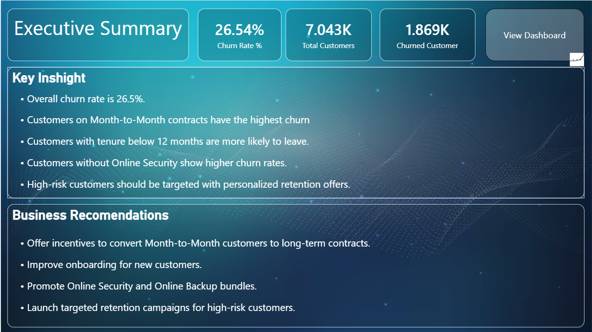
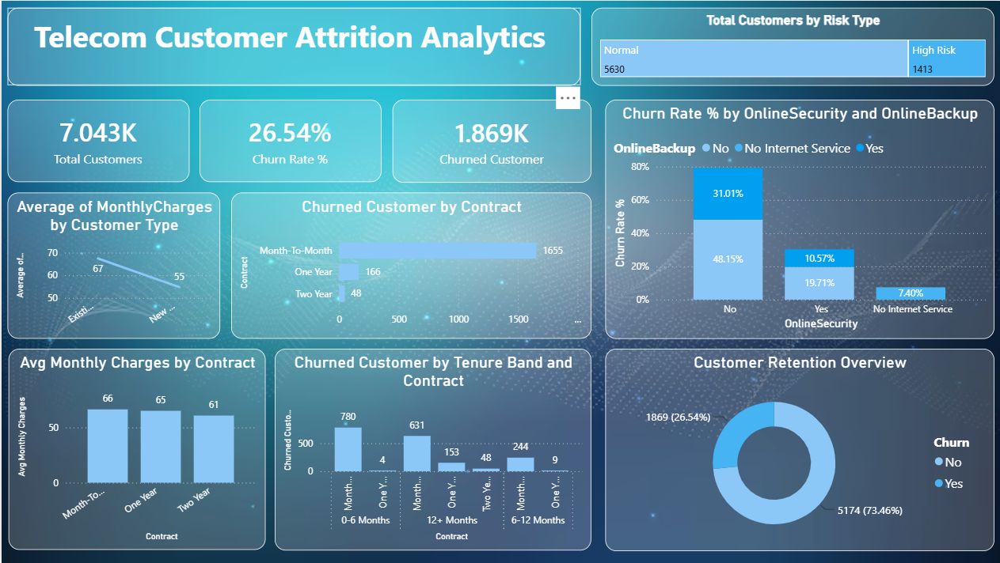

# 📊 Telecom Customer Attrition Analytics Dashboard

An interactive **Power BI dashboard** built to analyze customer churn in the telecom industry. This project identifies the key factors influencing customer attrition and provides actionable business recommendations using Power BI, DAX, and Power Query.

---

## 🎯 Business Problem

Telecom companies lose customers every month, leading to reduced revenue and increased customer acquisition costs.

The objective of this project was to:

- Identify the major churn drivers
- Analyze customer behavior
- Track business KPIs
- Recommend strategies to improve customer retention

---

## 🛠️ Tools & Technologies

- Power BI
- Power Query
- DAX
- Microsoft Excel

---

## 📈 Key Performance Indicators (KPIs)

- Total Customers
- Churn Rate (%)
- Churned Customers
- Customer Risk Type

---

# 📷 Dashboard Preview

## Executive Summary

The Executive Summary provides a high-level overview of customer churn, key performance indicators, major business insights, and recommended retention strategies for stakeholders.
---

## Analysis Dashboard

The analysis dashboard provides interactive insights into customer churn by examining contract type, tenure, online service adoption, customer risk segmentation, and monthly charges, enabling data-driven business decisions and customer retention strategies.
---

## 🔍 Dashboard Features

- Executive Summary Page
- Customer Risk Segmentation
- Contract-wise Churn Analysis
- Tenure-wise Churn Analysis
- Online Security & Online Backup Analysis
- Monthly Charges Analysis
- Customer Retention Overview

---

## 📌 Key Insights

- Customers on **Month-to-Month contracts** have the highest churn.
- Customers with **lower tenure** are more likely to leave.
- Customers **without Online Security** exhibit higher churn rates.
- Long-term contracts improve customer retention.
- High-risk customers should be prioritized for retention campaigns.

---

## 💡 Business Recommendations

- Encourage customers to switch to long-term contracts.
- Improve onboarding during the first year of service.
- Promote Online Security and Online Backup bundles.
- Launch personalized retention campaigns for high-risk customers.

---

## 📁 Repository Contents

| File | Description |
|------|-------------|
| Customer Attrition Analytics Dashboard_1.pbix | Power BI Dashboard |
| Telecom-customer-churn.csv | Dataset |
| executive-summary.png | Executive Summary Page |
| analysis-dashboard.png | Dashboard Screenshot |

---

## 👨‍💻 Author

**Naman Jain**

Aspiring Data Analyst | Business Analyst
